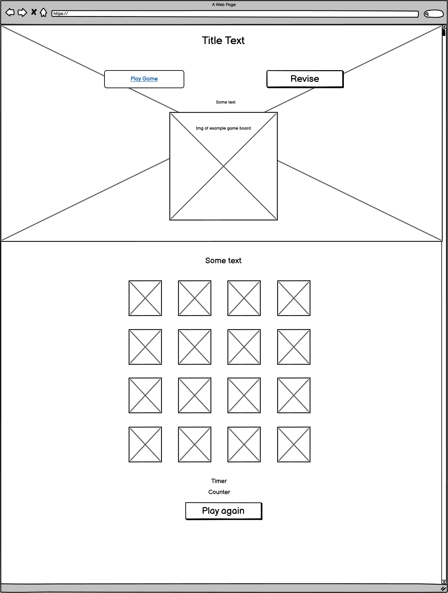
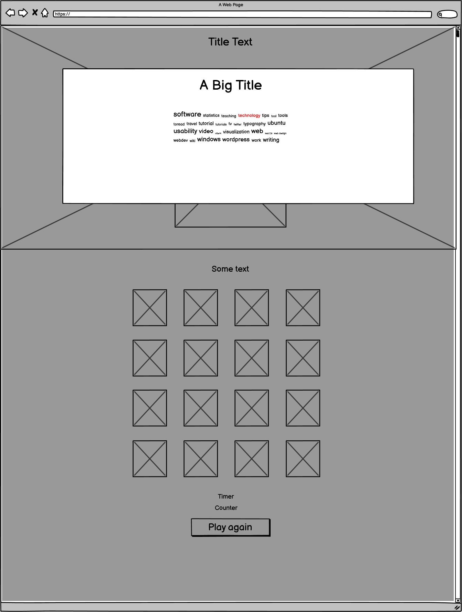
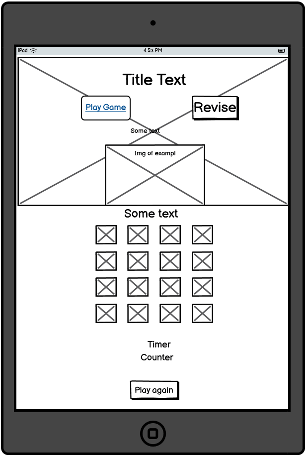
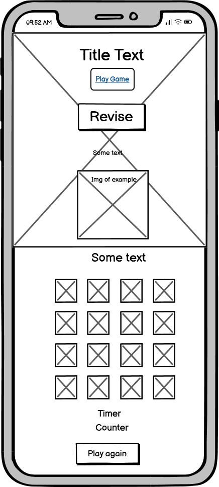
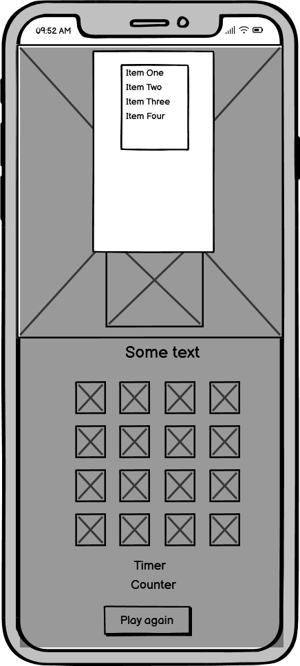
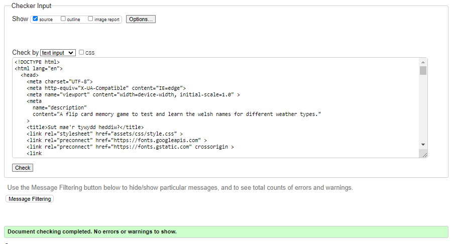
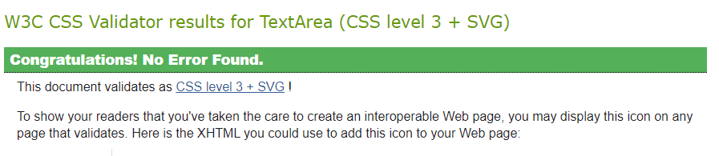
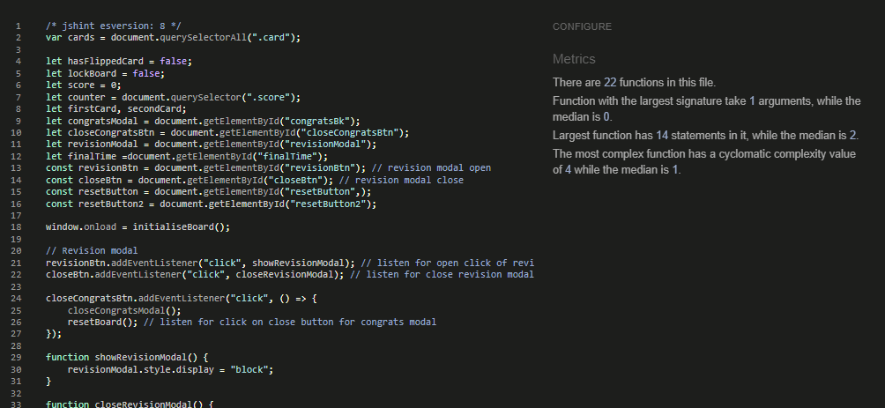
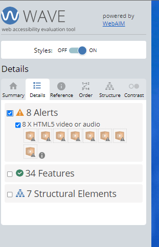

# Sut mae'r tywydd heddiw?

SMTH? is a card flip memory game designed to assist the learning of Welsh phrases of the weather. The idea was inspired from my own learning of the language and completing similar interactive activities to aid learning.

SMTH requires users to remember the position and the translation of the respective weather picture and match them accordingly.

### Live project

Find the live project [here](https://paddyw11.github.io/Paddy-walsh-project-2b/) DON'T FORGET TO update below also!

## Contents

- [Sut mae'r tywydd heddiw?](#sut-maer-tywydd-heddiw)
    - [Live project](#live-project)
  - [Contents](#contents)
  - [UX](#ux)
    - [User Stories](#user-stories)
  - [Design](#design)
    - [Wireframes](#wireframes)
      - [Desktop view](#desktop-view)
      - [Tablet view](#tablet-view)
      - [Mobile view](#mobile-view)
    - [Fonts](#fonts)
    - [Colours](#colours)
  - [Features](#features)
    - [Existing Features](#existing-features)
    - [Future Features](#future-features)
  - [Technologies](#technologies)
    - [Languages](#languages)
    - [Frameworks, Libraries and Programs Used](#frameworks-libraries-and-programs-used)
  - [Testing](#testing)
    - [Validator Testing](#validator-testing)
  - [Deployment](#deployment)
    - [How this site can be deployed](#how-this-site-can-be-deployed)
    - [How this site can be cloned](#how-this-site-can-be-cloned)
  - [Credits](#credits)
    - [Media](#media)
    - [Acknowledgements](#acknowledgements)

## UX

### User Stories

As a player of the game:

- I want to have fun.
- I want to learn the welsh words for different weathers.
- I want to undertand how to be able to play the game.
- I want to be able to keep log of my score and time.
- I want to be able to play again.

## Design

### Wireframes

#### Desktop view

#### Tablet view

#### Mobile view

### Fonts

- Open Sans, sans serif was used for simplistic design

### Colours

-I decided on a palette of colours to be used on the game board to make the game more pleasing and to add a connection between the pairs. - Sourced from Coolors.

- **#74a7ff** - Body background colour. It serves as a cloudless sky.

## Features

### Existing Features

- A simple and colorful page layout so users can easilty navigate to the relevant areas.
- A "Play now button" - takes the user directly to the game area to begin playing.
- A "Revise' section allows the user to revise the word pairings before playing.
- The game board contains the card that the user must match to complete the game.
- The number of moves and time taken area informs the user of their progress during game play.
- A play again button allows the user to reset the board to re-start the game.
- A congratulations modal informs the user of their completion of the game and infors them of their final number of moves and the complete game time.

### Future Features

- Including a leader board to showcase the top scorers could be a fun feature for competetiveness.
- Including an audio-off function as a harder test of memory.

## Technologies

### Languages

- [HTML5](https://en.wikipedia.org/wiki/HTML5)
- [CSS](https://en.wikipedia.org/wiki/CSS)
- [JS](https://en.wikipedia.org/wiki/JavaScript)

### Frameworks, Libraries and Programs Used

- [Google Fonts](https://fonts.google.com/) I used this for the Open Sans font throughout the site.

- [Tiny Png](https://tinypng.com/) This helped compress the images used on the site.

- [Coolors](https://coolors.co/) This was used to find a color palette.

- [Code Anywhere](https://app.codeanywhere.com/) - The IDE used to write code and commit to Github.

- [Github](https://github.com/) - The repository sire used to store the project pushed from Code Anywhere and used to delpoy the sita via Github Pages.

- [Chrome DevTools](https://developer.chrome.com/docs/devtools) - The built-in tool used to inspect the code, check for responsiveness and run performance tests.

- [Balsamiq](https://balsamiq.com/) was used to create the wireframes at the design stage of the site.

- [Beautify](<https://www.jpkc.com/tools/beautify/) was used to tidy up HTML, CSS and JS files.

## Testing

### Validator Testing

- [HTML Validator](https://validator.w3.org)
  - Result for index.html
  - 

- [CSS Validator](https://jigsaw.w3.org/css-validator/validator)
  - Result for style.css
  - 

- [JS Validator](https://jigsaw.w3.org/css-validator/validator)
  - Result for style.css
  - 

- [WAVE Validator](https://jigsaw.w3.org/css-validator/validator)
  - Result for site
  - 

## Deployment

### How this site can be deployed

- In the Github repository, navigate to the Settings tab, then choose pages from the left hand menu.
- From the build and deployment section ensure the source drop-down menu is showing deploy from a branch and the branch drop down is showing main, next click save and allow the page to refesh to deploy the page.

- Any changes now pushed to the master branch will be evident on the deployed page.

The deployed site can be found [here](https://paddyw11.github.io/Paddy-walsh-project-2b/)

### How this site can be cloned

- Log into Github or set up a new account.
- Navigate to the repository [here](https://github.com/paddyw11/Paddy-walsh-project-2b)
- Click on the code button, select whether to clone with HTTPS, SSH or Github CLI and copy the link shown.
- Open a terminal in a new IDE workspace where you wish to clone the repository to.
- Type 'git clone' into the terminal and paste the link copied from the original source repository and press the Enter key to begin the clone process.

## Credits

A number of resources were used to assist in the understandig of using HTML, CSS and Javascript to create a flip card memory game.
I used a walkthrough to log the basics, namely

### Media

- The fonts were imported from [Google Fonts](https"//fonts.google.com/)

- All images were downloaded from [Pixabay](https://pixabay.com/) for the card images.

### Acknowledgements

- I would like to thank:
  - My Code Institute Mentor and Cohort Supervisor,  and  respectively who have provided great advice and feedback on how to plan and execute this project.
  - Danny Walsh and James Walsh for their late-night game feedback.
  - Finally, Kim Dodd on her UX prowess.
