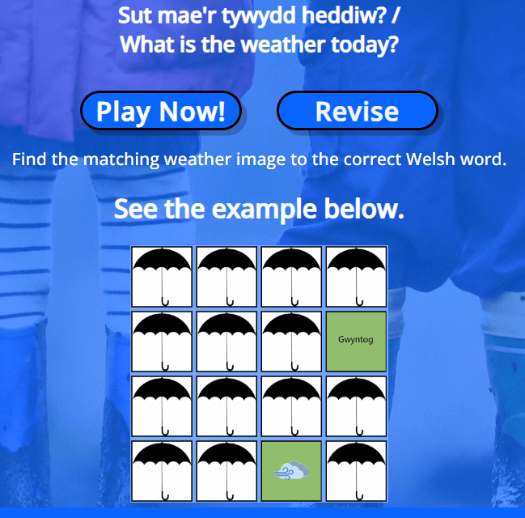

# Sut mae'r tywydd heddiw?

SMTH? is a card flip memory game designed to assist the learning of Welsh phrases of the weather. The idea was inspired from my own learning of the language and completing similar interactive activities to aid learning.

SMTH requires users to remember the position and the translation of the respective weather picture and match them accordingly.

### Live project

Find the live project [here](https://paddyw11.github.io/Paddy-walsh-project-2b/)

***

## Contents

  [Sut mae'r tywydd heddiw?](#sut-maer-tywydd-heddiw)
    - [Live project](#live-project)
- [Sut mae'r tywydd heddiw?](#sut-maer-tywydd-heddiw)
    - [Live project](#live-project)
  - [Contents](#contents)
  - [Project Goals and UX](#project-goals-and-ux)
    - [Project Goals](#project-goals)
    - [User Stories](#user-stories)
      - [Game Player User](#game-player-user)
  - [Design](#design)
    - [Wireframes](#wireframes)
      - [Desktop view](#desktop-view)
      - [Tablet view](#tablet-view)
      - [Mobile view](#mobile-view)
    - [Fonts](#fonts)
    - [Colours](#colours)
  - [Features](#features)
    - [Existing Features](#existing-features)
    - [Future Features](#future-features)
  - [Technologies](#technologies)
    - [Languages](#languages)
    - [Frameworks, Libraries and Programs Used](#frameworks-libraries-and-programs-used)
  - [Testing](#testing)
    - [Validator Testing](#validator-testing)
    - [User Stories Testing](#user-stories-testing)
      - [Game Player User](#game-player-user-1)
    - [Accessibility Testing](#accessibility-testing)
    - [Manual Testing](#manual-testing)
      - [Chrome for Android](#chrome-for-android)
      - [Safari for iPhone](#safari-for-iphone)
    - [Fixed Bugs](#fixed-bugs)
      - [Congrats Centred Text Bug](#congrats-centred-text-bug)
      - [Play Now button vs span](#play-now-button-vs-span)
  - [Deployment](#deployment)
    - [How this site can be forked](#how-this-site-can-be-forked)
    - [How this site can be cloned](#how-this-site-can-be-cloned)
    - [How this site can be deployed](#how-this-site-can-be-deployed)
  - [Credits](#credits)
    - [Media](#media)
    - [Acknowledgements](#acknowledgements)

***

## Project Goals and UX

### Project Goals

- The goal of the project is to make a fun and educational game that will help the user to learn the weather types in the Welsh language.

### User Stories

#### Game Player User

|Story Number|Story|
| :------: | ------ |
|1| As a player of the game,   I want to be able to know how to play the game   so that I can complete it.    I know this is met when I understand how to play. |
|2| As a player of the game,   I want to be able to revise the Welsh words for the weathers  so that I can complete it well.    I know this is met when I see the translations modal and understand the Welsh translations. |
|3| As a player of the game,   I want to be able to know my ongoing score and my current time   so that I can keep a track.    I know this is met when I see the score and timer box. |
|4| As a player of the game,   I want to be able to hear an audio hint when I turn over an image card   so that I can learn the translation better.    I know this is met when I hear the word of the corresponding image. |
|5| As a player of the game,   I want to be able to know when I have matched a pair on the game   so that I can celebrate and carry on to other cards.    I know this is met when I see the matching pair stay showing. |
|6| As a player of the game,   I want to be able to know when I have completed the game   so that I can celebrate.    I know this is met when I see the well-done box with score and timer. |
|7| As a player of the game,   I want to be able to play again   so that I can beat my last score.    I know this is met I have clicked the play again button and the game resets. |

***

## Design

### Wireframes

Below are the wireframes that show the layout of the site and its features.

#### Desktop view

 Click here to see the desktop wireframe.

 

 Click here to see the desktop wireframe with the congrats modal.

 

#### Tablet view

 Click here to see the tablet wireframe.

 

#### Mobile view

 Click here to see the mobile wireframe.

  

 

 Click here to see the mobile wireframe with revision modal.

  

 

### Fonts

Google Fonts Open Sans, sans serif was used across the site for simplistic design.

 
 
 

### Colours

I decided on a palette of colours to be used on the game board to make the game more pleasing and to add a connection between the pairs. - Sourced from [Coolors](https://coolors.co).

 **#74a7ff** - Body background colour. It serves as a nod to a cloudless sky.

***

## Features

### Existing Features

A simple and colorful page layout so users can easily navigate to the relevant areas.

A "Play now" button takes the user directly to the game area viewport to begin playing.

A "Revise" button and modal button allows the user to revise the word pairings before playing.

The game board contains the cards that the user must match to complete the game.
The elements/cards contain images which on click reverse to show their back side. The default 'front' side shows the umbrella image.

The number of moves and time taken area informs the user of their progress during game play.

 A play again button allows the user to reset the board to re-start the game.

 A congratulations modal informs the user of their completion of the game and informs them of their final number of moves and the complete game time.

### Future Features

- I could include a leader board to showcase the top scorers could be a fun feature for competitiveness.
- I could include an 'audio-off' function to increase difficulty.
- I could inlcude a 'remove colour' option for a harder test of memory.

***

## Technologies

### Languages

- [HTML5](https://en.wikipedia.org/wiki/HTML5)
- [CSS](https://en.wikipedia.org/wiki/CSS)
- [JS](https://en.wikipedia.org/wiki/JavaScript)

### Frameworks, Libraries and Programs Used

- [Google Fonts](https://fonts.google.com/) I used this for the Open Sans font throughout the site.

- [Tiny Png](https://tinypng.com/) This helped compress the images used on the site.

- [Coolors](https://coolors.co/) This was used to find a color palette.

- [Code Anywhere](https://app.codeanywhere.com/) - The IDE used to write code and commit to GitHub.

- [GitHub](https://github.com/) - The repository sire used to store the project pushed from Code Anywhere and used to deploy the sita via GitHub Pages.

- [Chrome DevTools](https://developer.chrome.com/docs/devtools) - The built-in tool used to inspect the code, check for responsiveness and run performance tests.

- [Balsamiq](https://balsamiq.com/) was used to create the wireframes at the design stage of the site.

- [Beautify](<<https://www.jpkc.com/tools/beautify/)> was used to tidy up HTML, CSS and JS files.

***

## Testing

### Validator Testing

 [HTML Validator](https://validator.w3.org/nu/?doc=https%3A%2F%2Fpaddyw11.github.io%2FPaddy-walsh-project-2b%2F)

   Result for index.html
   

 [CSS Validator](https://jigsaw.w3.org/css-validator/validator?uri=https%3A%2F%2Fpaddyw11.github.io%2FPaddy-walsh-project-2b%2F&profile=css3svg&usermedium=all&warning=1&vextwarning=&lang=en)
  
   Result for style.css
   

 [JS Validator](h<https://jshint.com/)>

Result for script.js

[WAVE Validator](https://jigsaw.w3.org/css-validator/validator)
  
Result for site
  

### User Stories Testing

#### Game Player User

|Story No.|Result|Story/ Evidence|
|-----|-----|-----
|1| Test Pass | As a player of the game,   I want to be able to know how to play the game   so that I can complete it.    I know this is met when I understand how to play.    Evidence: The example of matched pairs image makes clear what is expected when matching a pair.  |
|2| Test Pass | As a player of the game,   I want to be able to revise the Welsh words for the weathers  so that I can complete it well.    I know this is met when I see the translations modal and understand the Welsh translations.   Evidence:   |
|3| Test Pass | As a player of the game,   I want to be able to know my ongoing score and my current time   so that I can keep a track.    I know this is met when I see the score and timer box.   Evidence:    |
|4| Test Pass | As a player of the game,   I want to be able to hear an audio hint when I turn over an image card   so that I can learn the translation better.    I know this is met when I hear the word of the corresponding image.   Evidence: The respective audio file plays on activation of the image cards.|
|5| Test Pass | As a player of the game,   I want to be able to know when I have matched a pair on the game   so that I can celebrate and carry on to other cards.    I know this is met when I see the matching pair stay showing.   Evidence:    |
|6| Test Pass | As a player of the game,   I want to be able to know when I have completed the game   so that I can celebrate.    I know this is met when I see the well-done box with score and timer.   Evidence:    |
|7| | As a player of the game,   I want to be able to play again   so that I can beat my last score.    I know this is met I have clicked the play again button and the game resets.   Evidence:    |

### Accessibility Testing

To check the colours and fonts, I used the Lighthouse tool in Google Chrome's devtools. The result of the game site is below:

### Manual Testing

- I have tested that this page works in different web browsers.
- I have tested that the site is responsive and works with different device sizes. It looks good and functions as normal.
- I have tested that all text and fonts are readable and easy to understand.
- I have tested all buttons. They action the correct response, which is either to open a modal, navigate to user to a view port or reset the game board and timer.
- I have tested that the cards on the game board flip when clicked and don't flip when two are already flipped or it has been matched.
- I have tested the audio files play when the image cards are clicked.
- I have tested the score feature to increase ever time a pair is flipped.
- I have tested the timer begins on the first pair flip.
- I have tested the congratulations function appears when all the pairs have been matched and it displays the score and time at the point of completing.
- I have tested the Play again button to ensure it resets the board, randomises the locations and resets the timer and score.

Below is an example of some features on different browsers.

|Safari 17.2|Firefox 122.0|Chrome 121.0.6167.140|
| --------- | --------- | --------- |
||||
||||
||||
||||

#### Chrome for Android

#### Safari for iPhone

### Fixed Bugs

#### Congrats Centred Text Bug

During testing I noticed the congratulations message on the modal wasn't centred, pushed off centre owing to the 'x' close link. I applied a transform:translatex style to fix it. 

#### Play Now button vs span

The original Play Now button was located inside an "a" tag, which caused an error in the HTML Validator. I solved the problem by replacing the button with a span element.

***

## Deployment

### How this site can be forked

1. On GitHub.com, navigate to the creator's repository [here](https://github.com/paddyw11/Paddy-walsh-project-2b).
2. In the top-right hand corner, click on 'Fork'.
3. By default, forks are named the same as their parent repositories. You can change the name of the fork to distinguish it further.
4. Add a description of your fork.
5. Click 'Create Fork.

### How this site can be cloned

1. Log into GitHub or set up a new account.
2. Navigate to the repository [here](https://github.com/paddyw11/Paddy-walsh-project-2b)
3. Click on the code button, select whether to clone with HTTPS, SSH or GitHub CLI and copy the link shown.
4. Open a terminal in a new IDE workspace where you wish to clone the repository to.
5. Type 'git clone' into the terminal and paste the link copied from the original source repository and press the Enter key to begin the clone process.

### How this site can be deployed

1. In the GitHub repository, navigate to the Settings tab, then choose pages from the left hand menu.
2. From the build and deployment section ensure the source drop-down menu is showing deploy from a branch and the branch drop down is showing main, next click save and allow the page to refresh to deploy the page.

3. Any changes now pushed to the master branch will be evident on the deployed page.

The deployed site can be found [here](https://paddyw11.github.io/Paddy-walsh-project-2b/)

***

## Credits

A number of resources were used to assist in the understanding of using HTML, CSS and Javascript to create a flip card memory game.
I used a walkthrough to log the basics of the game, namely [Marina Ferreira's](https://github.com/code-sketch/memory-game).

### Media

- The fonts were imported from [Google Fonts](https"//fonts.google.com/)

- All images were downloaded from [Pixabay](https://pixabay.com/) for the card images and hero background.

- Sounds were recorded by the creator [Paddy](https://paddyw11.github.io/Paddy-walsh-project-2b/)

### Acknowledgements

I would like to thank:

- My Code Institute Mentor and Cohort Supervisor who have provided great advice and feedback on how to plan and execute this project.
- Danny Walsh and James Walsh for their late-night game feedback.
- Finally, Kim Dodd on her UX prowess.
